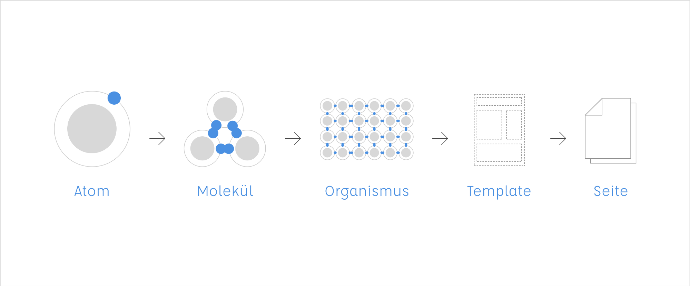
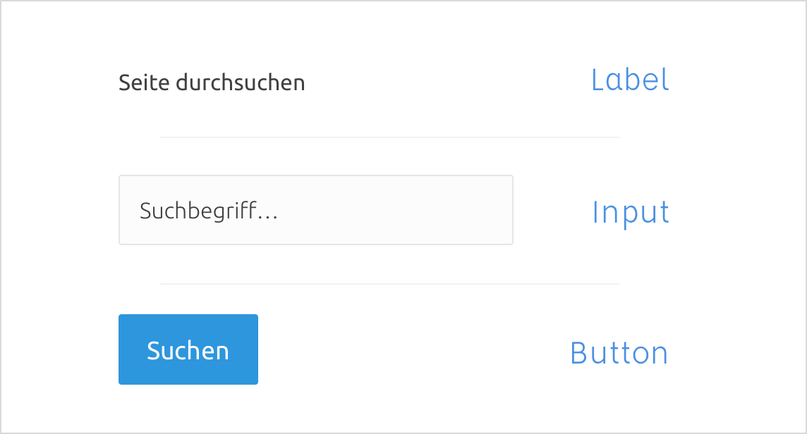
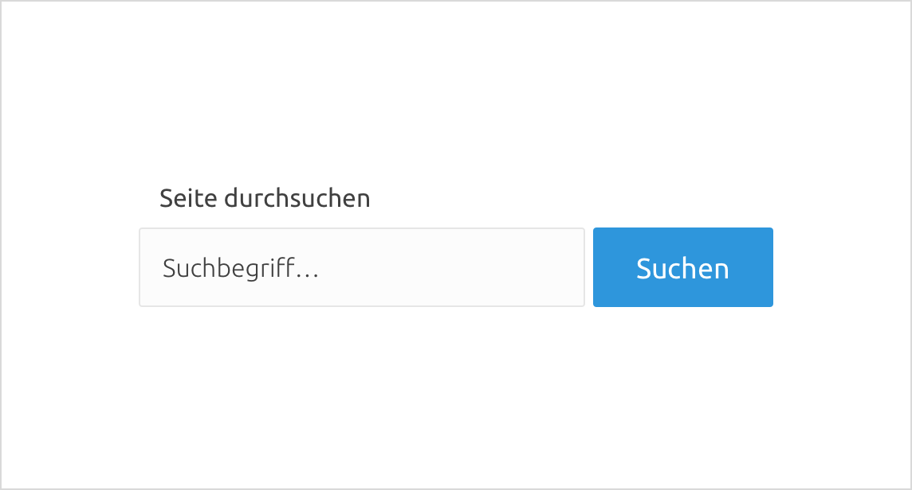
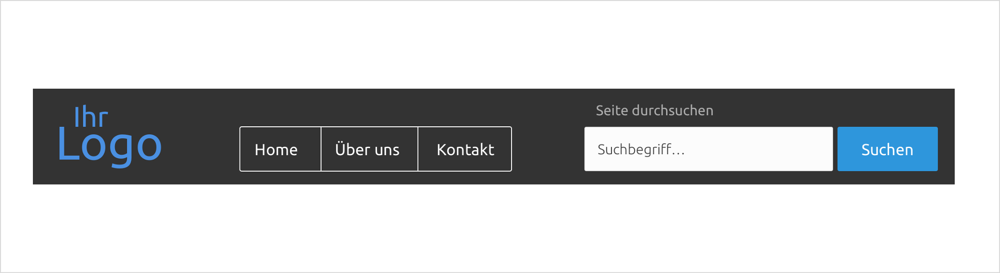
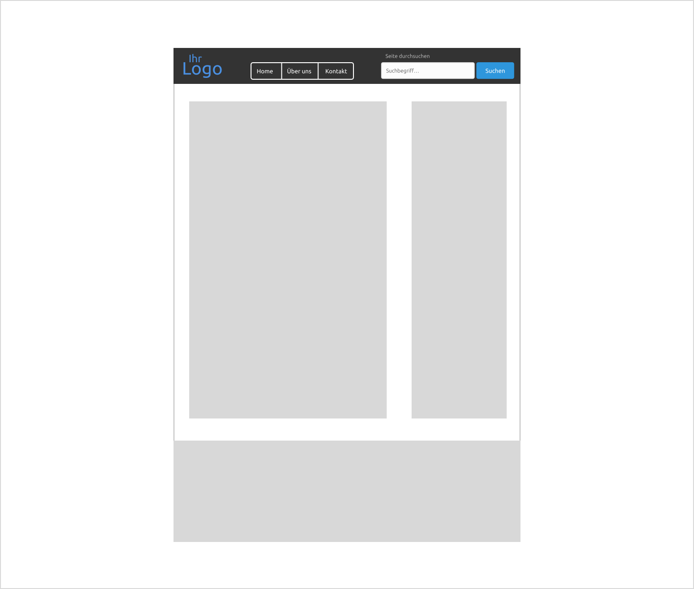
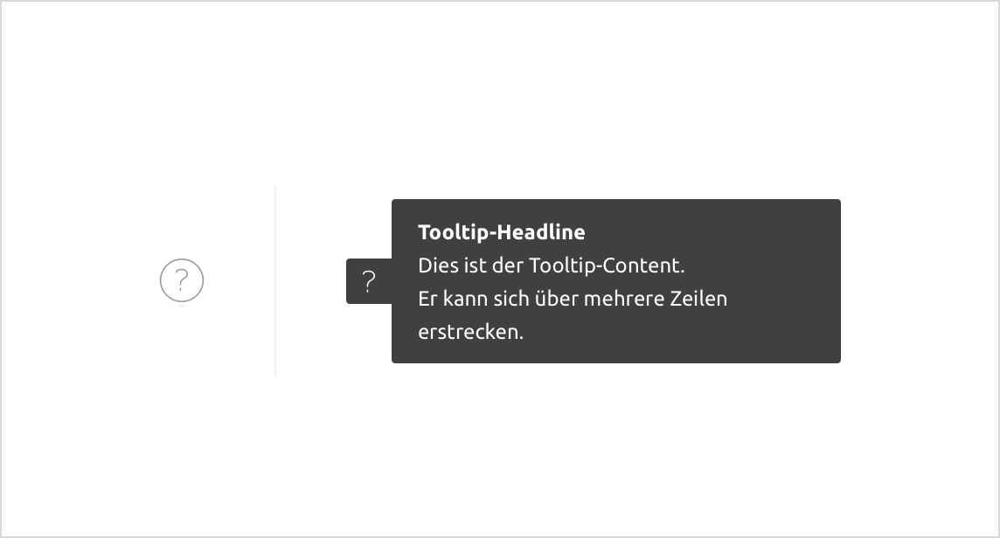

## [Atomic CSS](http://acss.io/)

### Design



1. Atoms
    - An HTML element, e.g. an `input`
    
2. Molecules
    - A set of HTML elements, a search for example including a `label`, `input` and a `button`
    
3. Organisms
    - A set of Molecules, like a header of a site. This site has in the header Organism: Site title, Beta remark, navigation and search
    
4. Templates
    - A wireframe of the wholes site, containing all the Organisms, layout starts to appear
    
5. Pages
    - The whole thing together, the most complex compound of all, the actual site with all it’s images and everything

### Structure

```
├── sass
    │
    ├── _atoms
    │   ├── _alert.sass
    │   ├── _button.sass
    │   ├── _figure.sass
    │   ├── _input.sass
    │   ├── _label.sass
    │   ├── _select.sass
    │   └── _textarea.sass
    │
    ├── _globals
    │   ├── _base.sass
    │   ├── _table.sass
    │   └── _text.sass
    │
    ├── _molecules
    │   ├── _buttongroup.sass
    │   ├── _field.sass
    │   └── _searchform.sass
    │
    ├── _organisms
    │   ├── _form.sass
    │   ├── _input.sass
    │   ├── _navbar.sass
    │   └── _sidebar.sass
    │
    ├── _pages
    │   └── _home.sass
    │
    ├── _settings
    │   ├── _mixins.sass
    │   ├── _functions.sass
    │   └── _variables.sass
    │
    ├── _templates
    │   ├── _about.sass
    │   ├── _news.sass
    │   └── _news-details.sass
    │
    └── style.sass
```

### Module Bundler

```
├── components
  │
  ├── _atoms
  │   │
  │   ├── Alert
  │   │   ├── _assets
  │   │   │   ├── _alert.style.sass
  │   │   │   └── _alert.script.js
  │   │   └── Alert.vue
  │   │
  │   ├── Button
  │   │   ├── _assets
  │   │   │   └── _button.style.sass
  │   │   └── Button.vue
  │   │
  │   ├── Input
  │   │   ├── _assets
  │   │   │   ├── _input.style.sass
  │   │   │   └── _input.script.js
  │   │   └── Input.vue
  │   │
  │   └── Label
  │     ├── _assets
  │     │    └── _label.style.sass
  │     └── Label.vue
  │
  ├── _molecules
  │   │
  │   ├── Buttongroup
  │   │   ├── _assets
  │   │   │   └── _buttongroup.style.sass
  │   │   └── Buttongroup.vue
  │   │
  │   └── InputRow
  │      ├── _assets
  │      │   └── _inputrow.style.sass
  │      └── InputRow.vue
  │
  ├── _organisms
  │   │
  │   ├── Navbar
  │   │   ├── _assets
  │   │   │   └── _navbar.style.sass
  │   │   └── Navbar.vue
  │   │
  │   └── Footer
  │       ├── _assets
  │       │   └── _footer.style.sass
  │       └── Footer.vue
  │
  ├── _templates
  │   │
  │   ├── Account
  │   │   ├── _assets
  │   │   │   └── _account.style.sass
  │   │   └── Account.vue
  │   │
  │   ├── Home
  │   │   ├── _assets
  │   │   │   └── _home.style.sass
  │   │   └── Home.vue
  │   │
  │   └── News
  │       ├── _assets
  │       │   └── _news.style.sass
  │       └── News.vue
  │
  └── style.sass
```

---

### Praxis



1. Icon/Trigger
2. real Tooltip
3. -> Tooltip-Headline
4. -> Tooltip-Content
